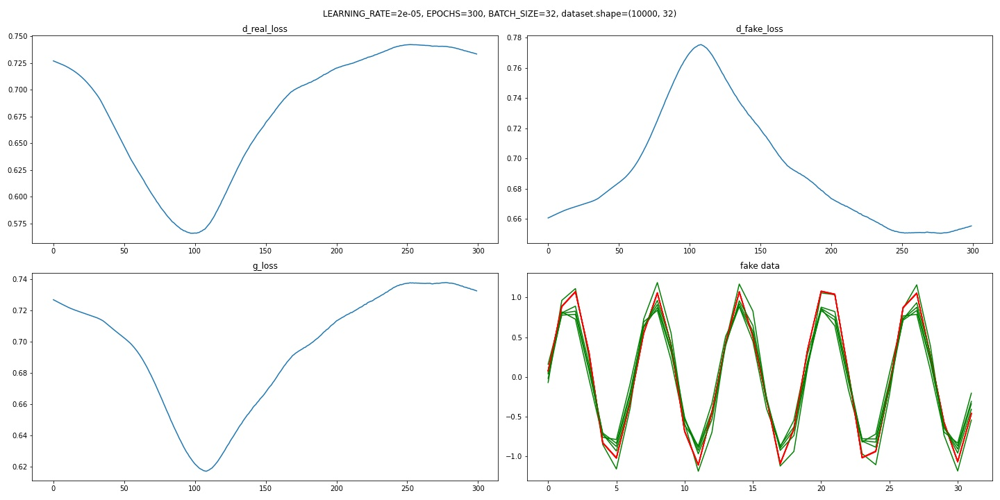

# GAN-SENOIDE-INICIANTE

### Trabalho iniciante para aprendizado no desenvolvimento de GAN

* **Todo trabalho foi desenvolvido em pytorch.**
 
* Aprendizado para desenvolvimento de GAN para um dataset fictício muito simples de duas dimensões **(1000, 32)** onde cada linha representa uma função senoidal com alguns parâmetros aleatórios. Amostra de alguns dados reais está na figura abaixo:  
 
 
* Algumas variáveis adotadas para o desenvolvimento:  
 ```
X_DIM = 32
SPACE_DIM = 4   # número de dimensões = LATENT_VECTOR
BATCH_SIZE = 32
EPOCHS = 300
DEBUG_STEPS = 30
LEARNING_RATE = 0.00002
 ```
 
* As camadas dos modelos são totalmente conectadas (nn.Linear) para este treinamento, mas em modelos com entrada de 3 canais com duas dimenções (**C**x**H**x**W**) são usadas outros tipos de camadas (como convolucionais, principalmente).
* O modelo para **generator**:  
```
def create_generator(n_output):
    return nn.Sequential(
        nn.Linear(in_features=SPACE_DIM, out_features=8),
        nn.ReLU(True),
        nn.Linear(in_features=8, out_features=16),
        nn.ReLU(True),
        nn.Linear(in_features=16, out_features=n_output),
        nn.Tanh()
    )
```

* O modelo para **discriminator**:  
```
def create_discriminator(n_input):
    return nn.Sequential(
        nn.Linear(in_features=n_input, out_features=16),
        nn.LeakyReLU(negative_slope=0.2),
        nn.Linear(in_features=16, out_features=8),
        nn.LeakyReLU(negative_slope=0.2),
        nn.Linear(in_features=8, out_features=1),
        nn.Sigmoid()
    )
```

* Os resultados a cada época para o **erro médio** para discriminator para real_data, fake_data e para generator.  

* No 4º gráfico (dos subplots) uma comparação entre dados reais e dados fakes gerados na última época, conforme exibido abaixo:  


* Por último, uma animação **(gif)** para um vetor **fixed_noise** criado no início do treinamento e a evolução das predições do **generator** em cada época.  

